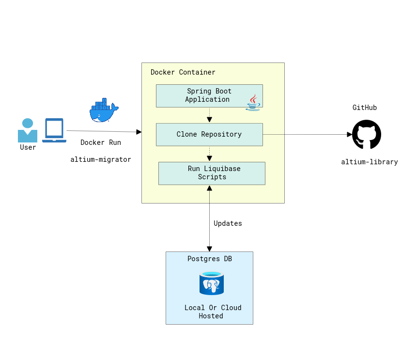
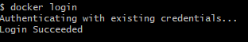

# Altium database migration tool

[](https://github.com/ximtech/altium-migrator/actions/workflows/build.yml)

The Altium database migration tool is a Spring boot application that helps handle changes from
[Git component repository](https://github.com/ximtech/altium-library) to local database for offline development
or any other hosted Postgres database by data source.


### How it works



1. User run docker command, then if application image is not in local storage it will be downloaded from public docker hub
2. The container will start with user provided DB connection or default for local development
3. After the start, application will fetch from repository migration scripts(database sql dump)
4. Then liquibase migration tool will check database state and update it if needed
5. Application can be run as many times as needed, it won't overwrite data or duplicate them.


### How to use it

1. First, download and install Docker here: [Download Docker Desktop for Windows](https://www.docker.com/products/docker-desktop/)
2. After Docker has been installed, check it with: `docker ps` in command prompt
3. Then need to signup/sign-in for Docker hub. Open Docker desktop and then `Sign in`: 


4. Check login with command: `docker login`



5. Now when Docker has configured. Need to install PostgresDB for local environment
    - ***First option.*** Run Database in container see [here](https://hub.docker.com/_/postgres)
      - Run in command line: `docker pull postgres`, it will pull the latest Postgres image
      - Run Database image: 
      ```
        docker run -d -p 5432:5432\
        --name dev-postgres \
        -e POSTGRES_PASSWORD=postgres \
        -e POSTGRES_USER=postgres \
        -e POSTGRES_DB=altium-components \
        postgres
      ```
    - ***Second option.*** Download and install Postgres for local development [here](https://www.postgresql.org/download/windows/) -> `Download the installer`
        - Download and install PgAdmin tool from [here](https://www.pgadmin.org/)
        - Create empty Database: 
          - 
        - In `Database` field write: `altium-components` -> `Save`
        - Check that empty database has been created: 
          - 
          
6. ***Optionally:*** Create DB schema, or `altium` will be created as default schema. It will be used for all migrations
7. When all has been configured and empty Database created. Then run application

***Local development***
``` text
docker run -p 5432:5432 -e PROFILE=docker-dev ximtech/altium-migrator
```

***Custom Database Hosting***

***Note:*** For custom datasource do not change `PROFILE` variable

```text
    docker run -p 5432:5432 \
    -e PROFILE=prod \
    -e ALTIUM_DB_DATASOURCE='jdbc:postgresql://host.docker.internal:5432/altium-components' \
    -e ALTIUM_DB_USERNAME='postgres' \
    -e ALTIUM_DB_PASSWORD='postgres' \
    -e LIQUIBASE_SCHEMA_NAME=altium \
    ximtech/altium-migrator:latest
```

7. At the end check that all data has been transferred:
- 
   
***Database Structure***
- 
